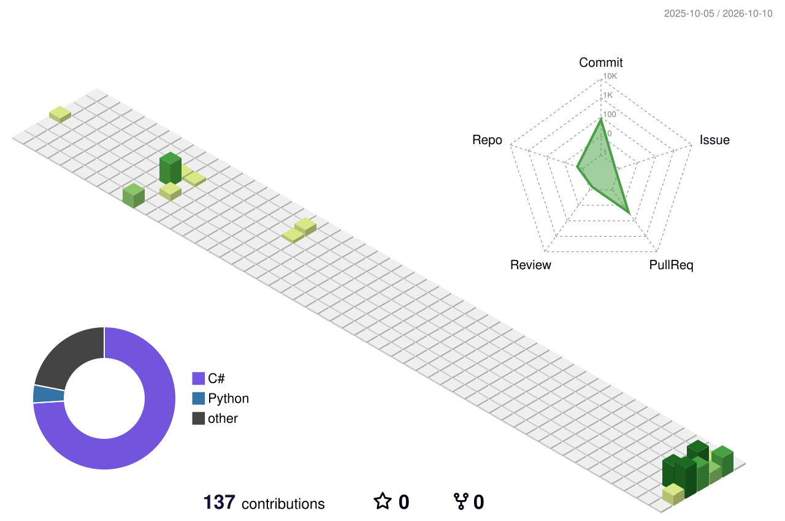

# Jeff Taylor

- **Army Forward Observer**: 75th Ranger Regiment, 173rd Airborne Brigade. Professionally good at finding coordinates.
- **Aerospace Manufacturing** to **Founder** of a tech startup
- Pursuing a **Graduate Degree**

**Toolbox:** `Python` `Java` `C#` `.NET` `JavaScript` `SQL` `C` `Azure` `Bicep` `GitHub Actions` `LaTeX` `Git` `Linux`

<picture>
  <source media="(prefers-color-scheme: dark)" srcset="./profile-3d-contrib/profile-night-view.svg">
  
</picture>

## Off the clock

$$N = R_* \cdot f_p \cdot n_e \cdot f_l \cdot f_i \cdot f_c \cdot L$$

<!-- If you change any estimate, update N (the product of all seven). -->

| Term | Meaning | My estimate |
|---|---|---|
| $R_st$ | New stars formed in the Milky Way per year | 1.5 |
| $f_p$ | Fraction of stars with planets | 1 |
| $n_e$ | Habitable planets per planetary system | 0.05 |
| $f_l$ | Fraction of those where life appears | 0.001 |
| $f_i$ | Fraction of those where intelligence appears | 1 |
| $f_c$ | Fraction of those that become detectable | 0.9 |
| $L$ | Years a civilization stays detectable | 10,000 |
| $N$ | Detectable civilizations in the galaxy | **0.675** |

Error bars available on request. They are large.

<details>
<summary>My reasoning</summary>

- $R_st$: The Milky Way turns roughly 1.5 to 2 solar masses of gas into stars each year.
- $f_p$: Exoplanet surveys suggest nearly every star has planets.
- $n_e$: Somewhere temperate is common. Somewhere actually habitable is not.
- $f_l$: Getting chemistry to become biology is the hard step.
- $f_i$: Once life gets going, give it time and intelligence follows.
- $f_c$: Most intelligent life ends up making noise.
- $L$: Hopeful, but OK.

</details>


```
01001001
01110100
00100000
01100110
01110010
01101111
01101101
00100000
01100010
01101001
01110100
```

---

<!-- HOLO:START -->
<sub><i>This page holds 17,752 bits. A black hole storing the same information would have a horizon of about 49,220 Planck areas.</i></sub><br>
<sub><i>The observable universe has had about 10<sup>90</sup> bits and 10<sup>120</sup> operations to work with (Lloyd, 2002).</i></sub>
<!-- HOLO:END -->
